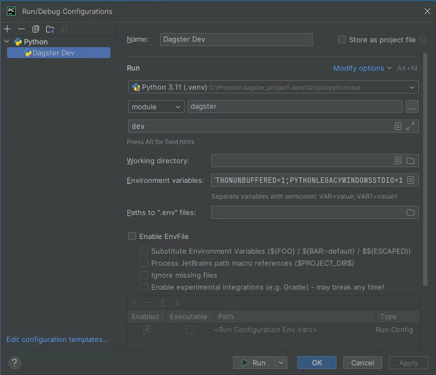

# Мозаика: поток данных


## Быстрый старт

Клонируем репозиторий.
```bash
pip install -e ".[dev]"
```

Then, start the Dagster UI web server:

```bash
dagster dev
```

Open http://localhost:3000 with your browser to see the project.

You can start writing assets in `etl_wo/assets.py`. The assets are automatically loaded into the Dagster code location as you define them.

## Development

### Adding new Python dependencies

You can specify new Python dependencies in `setup.py`.

### Unit testing

Tests are in the `etl_wo_tests` directory and you can run tests using `pytest`:

```bash
pytest etl_wo_tests
```

### Schedules and sensors

If you want to enable Dagster [Schedules](https://docs.dagster.io/guides/automate/schedules/) or [Sensors](https://docs.dagster.io/guides/automate/sensors/) for your jobs, the [Dagster Daemon](https://docs.dagster.io/guides/deploy/execution/dagster-daemon) process must be running. This is done automatically when you run `dagster dev`.

Once your Dagster Daemon is running, you can start turning on schedules and sensors for your jobs.

## Deploy on Dagster+

The easiest way to deploy your Dagster project is to use Dagster+.

Check out the [Dagster+ documentation](https://docs.dagster.io/dagster-plus/) to learn more.


